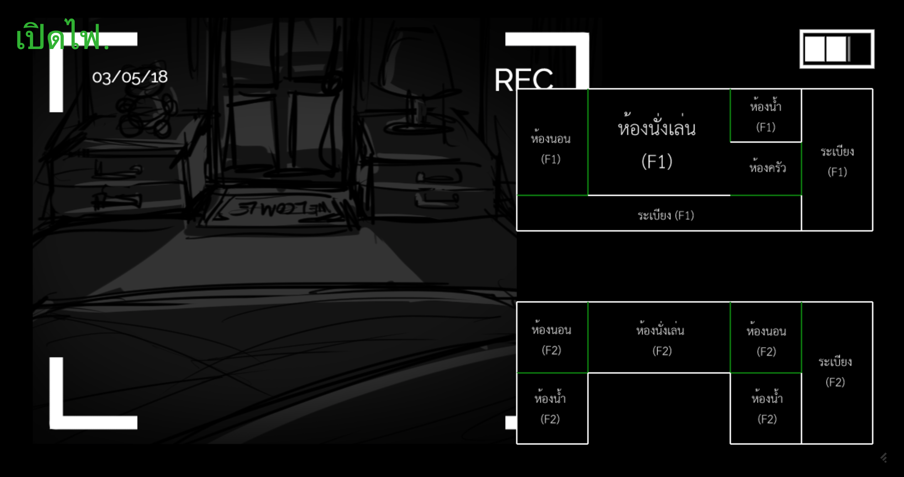

One Night At Bro's
===



> This project is a part of automatic speech recognition final project

This is an horror game with interactive voice command.
You are the player that sitted in bedroom in 1st floor (ห้องนอน F1).

There are two ghosts inside this house. Try to block the path by closing the door in each room.
Navigate around the house to see where is the ghost and plan your best stategy to win this game.

Survive as long as you can to win.

*This project was inspired by [Five Night at Freddy's](https://store.steampowered.com/app/319510/Five_Nights_at_Freddys/) game*

## Game Control

This game is interact with your voice.
There are several commands that you should try.

- "เปิดไฟ" – Open the light in active camera's room to banish the ghost.
- "สลับ กล้อง ไป ที่ <room> <floor>" – Change the active camera's room. (Some room requires the floor number to distinguish)
- "สลับ กล้อง ไป ที่ <floor> <room>" – Same as above.
- "ปิด ประตู ฝั่ง <direction>" - Close the door in active camera's room.
- "ปิด ประตู ด้าน <direction>" – Same as above.

## Usage

```
docker-compose up
```

and open website on `localhost:8000`

Click on the empty black screen to start the game.
To clear the log messages on screen, press `C`. To disable log messaging, press `D`.
Refresh the page to restart the game.

## Project

This repository includes only the backend system (The voice recognition system).
For implementation details in frontend, please see [https://github.com/Vomoboros/ASR_Project/](https://github.com/Vomoboros/ASR_Project/).

## License

[MIT](LICENSE) © Kosate Limpongsa
